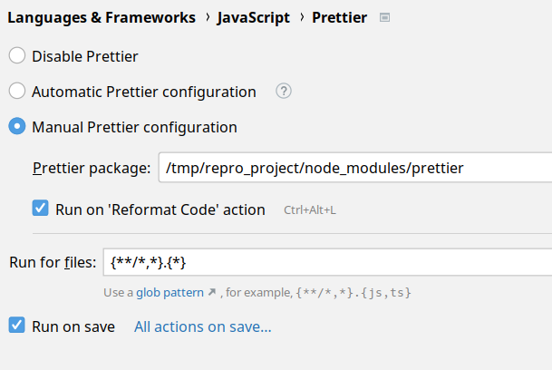

# JetBrains repro

https://youtrack.jetbrains.com/issue/WEB-63627

1. Open this project
2. Run npm install
3. Configure prettier like this:
4. 
5. Create a new typescript scratch
6. Enter some ts code
7. Run action "reformat with prettier"
